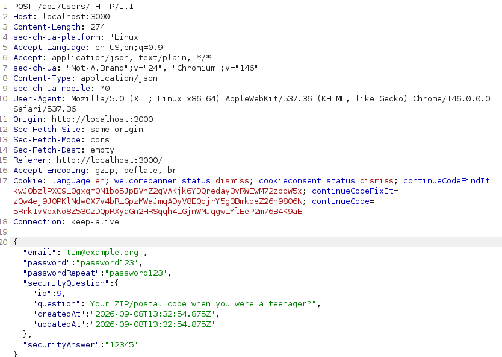
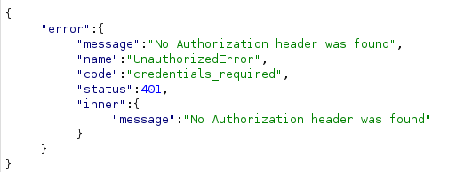
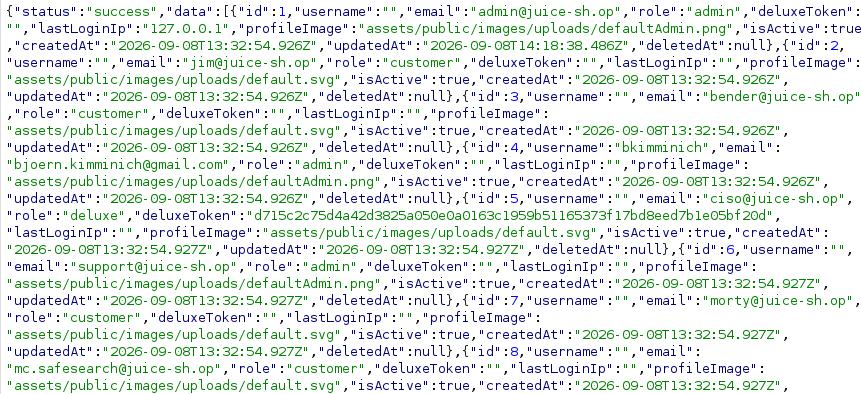
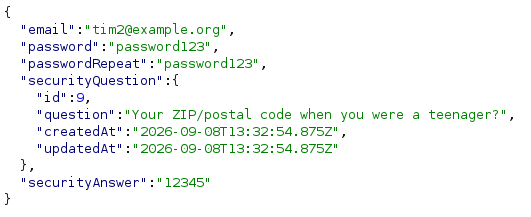
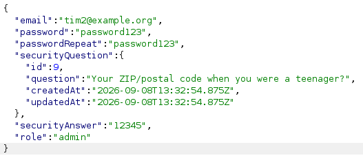
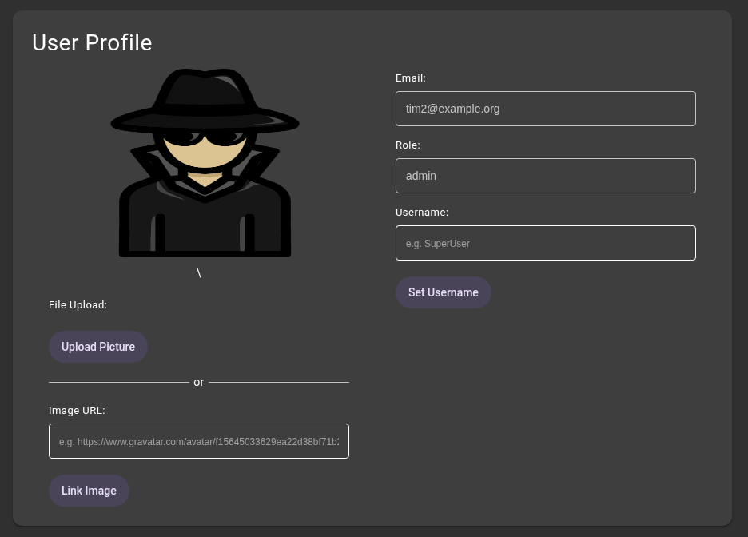

# Admin Registration

## 1. Figuring out the `User` model

1. When registering, the application sends a `POST` request to `/api/Users/`, to create a new user.
    
2. I tried changing the request method to `GET` using Burp Suite, hoping it would give me a list of all users and their roles.
3. Just changing the `POST` to a `GET` request gave me an unauthorized error:
    
4. So, I logged in using the regular account I created earlier and tried again, this time with the account's `Authorization` header,
    which gave me a list of all users:
    
    
    - This itself is a security flaw, since I - as a regular customer - should not be allowed to see all users. Especially things like email addresses or `deluxeToken`.
5. From that reply, I can see that all users have a `role` field, each with one of the following values:
    - `customer`
    - `admin`
    - `deluxe`

## 2. Registering as an admin

1. Since the `GET` endpoint is not properly validated, I decided to try setting `"role": "admin"` in the login request, to see if the server validates it.
2. So, I created a new user again and intercepted the request to edit it in Burp Suite:
   
3. I then added the `role` field with the value `admin`, as seen in the list of users above:
    
4. I forwarded the request, which immediately showed me a success notification:
    
5. When logging in and navigating to `/profile`, I can see that my new account was indeed created with the `admin` role:
   

## 3. How to fix this vulnerability

Firstly, normal users should not be allowed to get a list of all users on the platform, since that's not needed for
customers in an online shop. Even if that was intended, revealing sensitive information (like email addresses or the
token used for the paid deluxe feature) should not be a part of the response.

But, more importantly, the server should check the request when signing up, and only allow the necessary fields like
`email`, `password`, `passwordRepeat`, `securityQuestion` and `securityAnswer`. All other fields should either be
ignored or cause an error, but not be unconditionally applied to anyone signing up.
