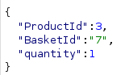
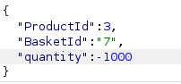
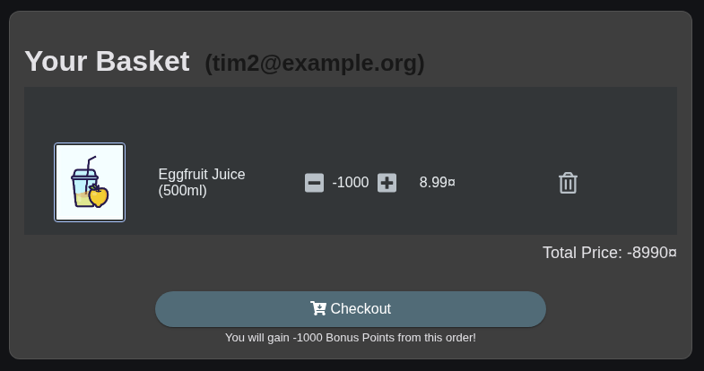
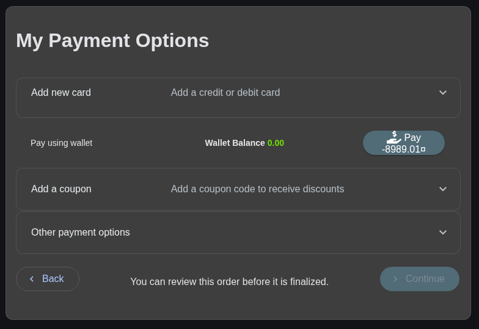
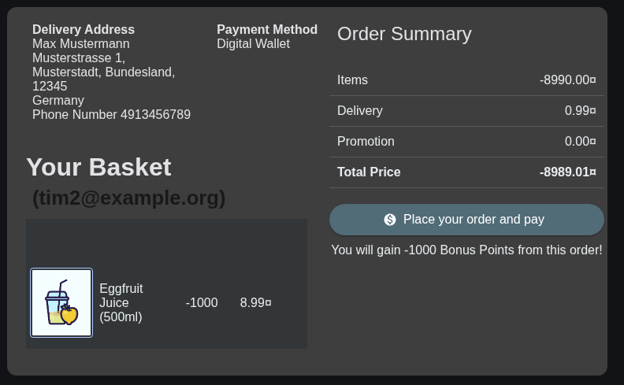
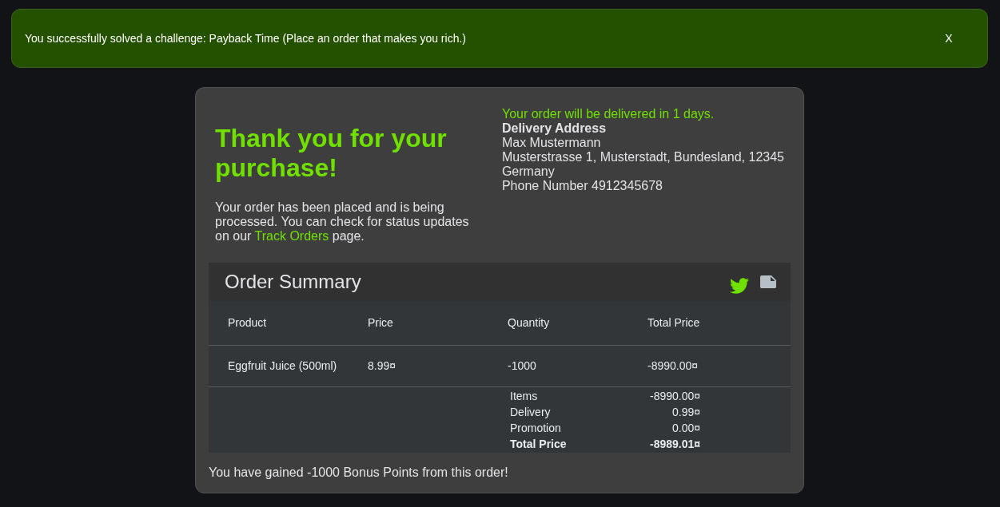
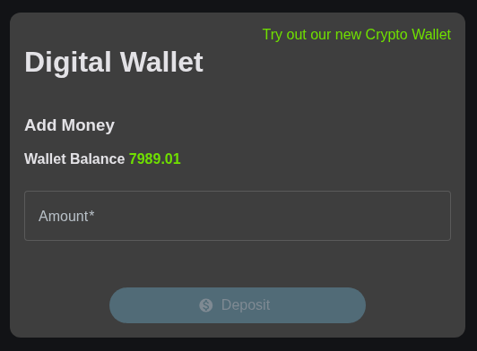

# Payback Time

## 1. Creating an order with a negative price

1. When adding an item to the basket, the frontend sends a request to the backend containing the `ProductId`, `BasketId` and `Quantity`:
    
   
2. After intercepting this request with Burp Suite, I can edit the `quantity` to a negative number, which - if ti works -
    would make the order have a negative price.

    
3. After forwarding the modified request and opening my basket, I can see that I have -1000 Eggfruit Juices, having a total
    price of -8990¤.

    
4. I added a (fake) address and chose a delivery method, which got me to the checkout page:

    
5. I chose "Pay using wallet" and confirmed the order:

    
6. This placed an order with a price of -8989.01¤, and added 7989.01 (8989.01¤ - 1000 Bonus points) to my wallet:
    
    
    

## 2. How to fix this vulnerability

When adding items to the basket, the server must verify that the amount of items added is not negative.
Additionally, checking the total price of an order before allowing users to pay to be positive is also a good idea.

My first idea was that the price could be modified on the frontend, which was not possible, since the client only sends
the product id and the server handles the price calculation. This is good, but the quantity should be validated before
adding!